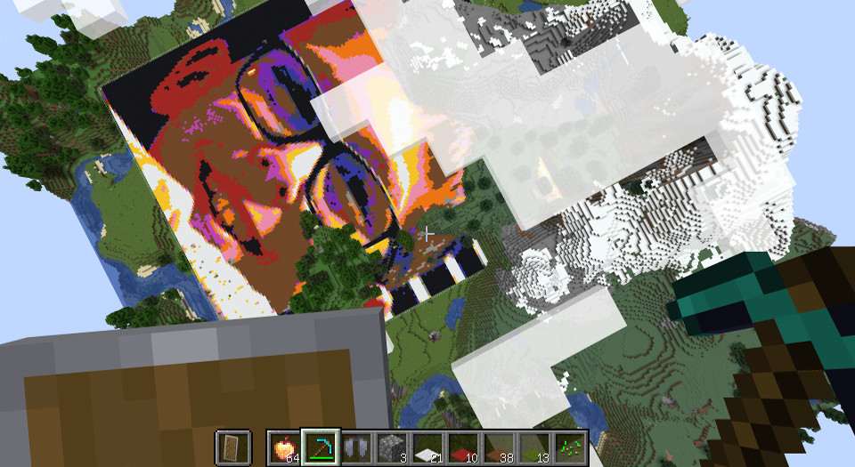

# minecraft-img-to-script
Image to Minecraft script converter.

For example, converting this:

...
into the game:



First here's **how to create a working script.**

When you launch the Minecraft server, precise the name of a world 
by using the `--universe` option, like this:

```
java -jar server.jar nogui --universe my_world
```

With the previous example you will get a folder called `my_world`.
In this folder, Minecraft creates a sub-folder like 
`world-[Year]-[Month]-[day]` so right now this will is, like this:

```
my_world/world-2020-01-20/
```

In this folder you will find a folder `datapacks`: 

```
my_world/world-2020-01-20/datapacks/
```

This is where you will create your group of function. Let's call it `hqf`:

```
my_world/world-2020-01-20/datapacks/hqf/
```

In that folder create an empty file called **`pack.mcmeta`**, and put
this text in it:

```
{
   "pack": {
       "pack_format": 1,
       "description": "Data Pack"
   }
}
```
Now create another sub-folder called `data` and in this folder
create another one(!) sub-folder called `functions`.

**You should have a tree like this:**

```
world-2019-03-12/datapacks/hqf/
└── data
    └── hqf
        └── functions
```

Yes, you have **twice** `hqf` like this:

```
world-2019-03-12/datapacks/hqf/data/hqf/functions/
```

It's very important to note that the `functions` folder is where your
script should go.

Now, look for a picture with a max size of 150 x 150
(it's Minecraft's limitations), and try to use
the `main.py` to convert the picture to a Minecraft script.

Note (very important too!) that the name of the destination file **must
end** with `.mcfunction`!


## Working example

My working command line:

```
python3 main.py -i 0.png \
-o "/[blabla]/my_world/world-2019-03-12/datapacks/hqf/data/hqf/functions/img.mcfunction"
```

Give the admin rights to a player:

```
/op surfer_ix
```

Then, with the player: launch Minecraft player,
and once connected, type:

```
/function hqf:img
```


## Torch / orientation

Even though it seems strange, there is very little information on how to
choose a "torch" orientation.

What worked for me is (as of Minecraft 1.18.xx):

- it's **not** "`/setblock ~1 ~1 ~0 torch[whatever]`"
- it's **not** "`/setblock ~1 ~1 ~0 torch [number]` 
  (oh my god so many useless examples like this!)

It's
```
/setblock ~1 ~1 ~0 wall_torch[facing=north]
```

It's not `torch`, it's **`wall_torch`**!
